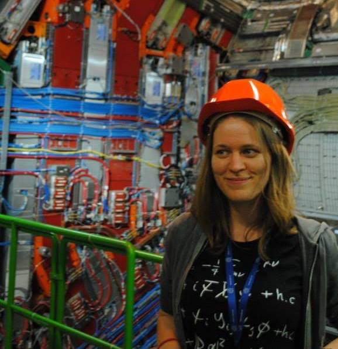
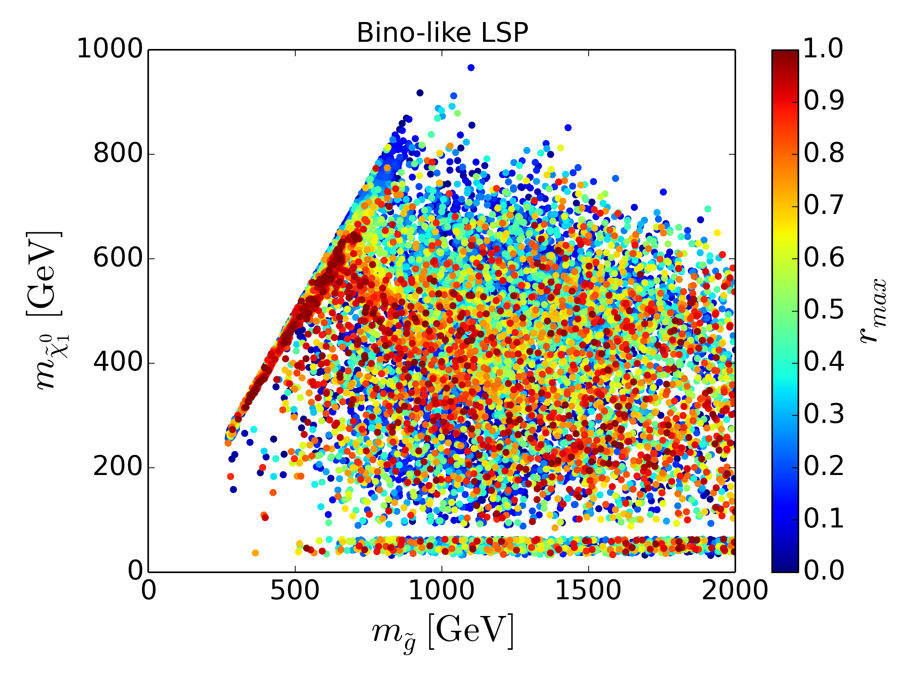
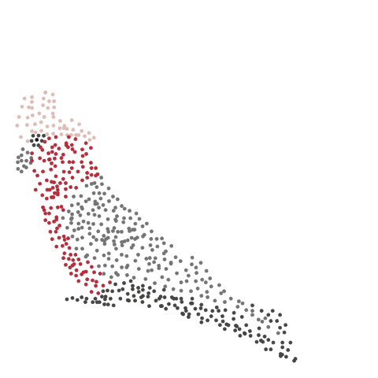

layout: false
class: split-25

<style type="text/css">
.remark-slide-content{
font-size: 30px;
}
code.r{
  font-size: 24px;
}

</style>

```{r setup, include=FALSE}
options(htmltools.dir.version = FALSE, width = 120)
library(tidyverse)
library(knitr)
library(kableExtra)
library(htmltools)
opts_chunk$set(
  echo = TRUE, warning = FALSE, message = FALSE, comment = "#>",
  fig.path = 'figure/', cache.path = 'cache/', fig.align = 'center',
  fig.width = 12, fig.height = 4, fig.show = 'hold',
  cache = FALSE, external = TRUE, dev = 'png', dev.args = list(bg = "transparent")
)
mp4_vid <- function(src, width){
  HTML(
    paste0(
      '<video width="', width, '" loop autoplay>
        <source src="', src, '" type="video/mp4">
      </video>'
    )
  )
}
```


```{css, echo=FALSE}
/* custom.css */
:root{
  --main-color1: #509e2f;
  --main-color2: #bcbddc;
  --main-color3: #efedf5;
  --main-color4: #9DDAE5;
  --text-color3: black;
  --text-color4: black;
  --code-inline-color: #4e5054;
  --link-color: #006CAB;
}
.large { font-size: 150% }
.largeish { font-size: 120% }
.summarystyle { font-size: 150%;
  line-height:150%;}
```

.column[.bottom_abs.content[

]]

.column.bg-main1[.content.vmiddle[.center[


# Introduction to ggplot2
### Workshop

<br>
<br>

# Ursula Laa


### Institute of Statistics
### University of Natrual Resources and Life Sciences
### (BOKU)

]]]

---
layout: false
class: split-66

.column[.content[


# A bit about me

<br>

```{r map1, fig.height=6, echo=FALSE}
world_map <- map_data("world")
ggplot(world_map, aes(x = long, y = lat, group = group)) +
  geom_polygon(fill="lightgray", colour = "white") +
  geom_polygon(fill="red", data = filter(world_map, region == "Austria")) +
  theme_void()
```
]]

.column[.content.vmiddle[.center[


<br>


]]]

---
layout: false
class: split-66

.column[.content[


# A bit about me

<br>

```{r map2, fig.height=6, echo=FALSE}
world_map <- map_data("world")
ggplot(world_map, aes(x = long, y = lat, group = group)) +
  geom_polygon(fill="lightgray", colour = "white") +
  geom_polygon(fill="red", data = filter(world_map, region == "France")) +
  theme_void()
```
]]

.column[.content.vmiddle[.center[


<br>


]]]

---
layout: false
class: split-66

.column[.content[


# A bit about me

<br>

```{r map3, fig.height=6, echo=FALSE}
world_map <- map_data("world")
ggplot(world_map, aes(x = long, y = lat, group = group)) +
  geom_polygon(fill="lightgray", colour = "white") +
  geom_polygon(fill="red", data = filter(world_map, region == "Australia")) +
  theme_void()
```
]]

.column[.content.vmiddle[.center[


<br>


```{r, out.width='60%', out.height='60%', autoplay=FALSE, echo=FALSE}

```
]]]
---
layout: false
class: split-66

.column[.content[


# A bit about me

<br>

```{r map4, fig.height=6, echo=FALSE}
world_map <- map_data("world")
ggplot(world_map, aes(x = long, y = lat, group = group)) +
  geom_polygon(fill="lightgray", colour = "white") +
  geom_polygon(fill="red", data = filter(world_map, region == "Austria")) +
  theme_void()
```
]]

.column[.content.vmiddle[.center[


]]]
---

# Workshop today

Today we will learn about building different graphs with `ggplot2`. We will use the `palmerpenguins` data for examples, and maybe also other packages from the `tidyverse` to get our data into tidy format.

Before getting started make sure you have these packages installed, and load them into your R session if you want to follow along during the workshop.

```{r, eval=FALSE}
install.packages("tidyverse")
install.packages("palmerpenguins")
```

```{r}
library(palmerpenguins)
library(tidyverse)
```

---

# Data example

The data we work with collects information about three species of penguins from Antartica, check documentation at https://allisonhorst.github.io/palmerpenguins/articles/intro.html. It's like a fun alternative to the Iris data.

```{r}
glimpse(penguins)
```


---
# Data visualisation the base R way

We can make a histogram of any vector, this is actually easy:

```{r}
hist(penguins$body_mass_g)
```

---
# Data visualisation the base R way

Making a bar chart (without going through the `plot()` function) is already a bit more work, and the interface is different. Let's try to show counts by species and island:

```{r}
species_count <- table(penguins$species, penguins$island)
species_count
```

---
# Data visualisation the base R way

```{r}
barplot(species_count, legend = rownames(species_count))
```

---
# Data visualisation the base R way

.largeish[
What makes this approach cumbersome? 

- We need to know the specific plotting functions and how its interface works
- We often need to prepare the data first, to match these interfaces
- It's difficult to make small changes, we often need to come back to the data preparation step

Alternative approach:

- Work with a standard data structure that is the input to a standard plotting interface
- Define a grammar of how to map elements from the data structure onto the drawing canvas
]

--

.center.large[tidy data + grammar of graphics]

---
# Tidy data

<br>

.largeish[
There are three principles of tidy data:
1. Each **variable** must have its own **column**. That means we make one column in our data frame for each measurement we make. In the penguin data these are the species and island, the various length measurements, the body mass, and the year.
2. Each **observation** must have its own **row**. That means each time we are measuring our variables, we are adding a row to our data. In our example, we have one row for each individual penguin that has been observed.
3. Each **value** must have its own **cell**. If we make sure to implement the first two rules properly, this will automatically be true!
]

---
# Tidy data

Illustration from the R for data science textbook:

.column[.content[.center[

]]]

---
# Grammar of graphics

<br>


.largeish[
The grammar of graphics defines a framework to construct statistical graphics in a principled way, by defining an explicit relationship between the variables in the data you have and the graphic or plot you wish to represent.

It was first defined by **Lee Wilkinson** and extended by **Hadley Wickham** in the R package `ggplot2` (part of the `tidyverse`).]

.large[
It is based on using **tidy data**, defining **mappings** between input variables onto _aestetics_, and using **geoms** to select the _graphical primitives_.
]
---
# Our first ggplot

.large[
When using the grammar of graphics we are defining our plot in steps. This means it takes a bit longer to get started compared to the simple hist function in base R, but in the long run we get a lot of extra flexibility and it is much easier to get the graph you want in most cases.

Generally you can think about your graph as getting built in **layers**, they are combined via the `+` symbol in your code. Let's see how this works by recreating the first histogram we made.
]
---

layout: false
class: split-33

.column[.content[
## Our first ggplot


We start by passing our **data set** to the ggplot function

```{r plot1, eval=FALSE, echo=TRUE}
ggplot(penguins) #<<
```

]]

.column[.content.vmiddle[
```{r output1, ref.label="plot1", echo=FALSE, cache=TRUE, fig.height = 5, fig.width=10}
```
]]

---

layout: false
class: split-33

.column[.content[
## Our first ggplot


We next define the **aesthetic mapping** (or **variable mapping**)


```{r plot2, eval=FALSE, echo=TRUE}
ggplot(penguins) +
  aes(x = body_mass_g) #<<
```

]]

.column[.content.vmiddle[
```{r output2, ref.label="plot2", echo=FALSE, cache=TRUE, fig.height = 5, fig.width=10}
```
]]

---

layout: false
class: split-33

.column[.content[
## Our first ggplot


Finally we specify the **geom** we want to draw 


```{r plot3, eval=FALSE, echo=TRUE}
ggplot(penguins) +
  aes(x=body_mass_g) +
  geom_histogram() #<<
```

]]

.column[.content.vmiddle[
```{r output3, ref.label="plot3", echo=FALSE, cache=TRUE, fig.height = 5, fig.width=10}
```
]]

---

layout: false
class: split-33

.column[.content[
## Our first ggplot


We can adjust the graph, e.g. to get wider bins that are closer to what the `histogram()` function did.


```{r plot4, eval=FALSE, echo=TRUE}
ggplot(penguins) +
  aes(x=body_mass_g) +
  geom_histogram(
    binwidth = 500 #<<
    )
```

]]

.column[.content.vmiddle[
```{r output4, ref.label="plot4", echo=FALSE, cache=TRUE, fig.height = 5, fig.width=10}
```
]]

---
# Our first ggplot

Once you understand these components you can make your code shorter, for example we get the same graph from

```{r}
ggplot(penguins, mapping = aes(x=body_mass_g)) +
  geom_histogram(binwidth = 500)
```


---
# Our first ggplot

.large[
Breaking down the components:
]

.largeish[

- to initializing the graph we pass our **data** into the `ggplot()` function
- we use the `aes()` function to define the aestetics **mapping**, how do the columns of your data correspond to the different aesthetics on the plot (we will see more of these soon)
- we use the specific `geom_` functions to define the **graphical primitive** we want (here we only drew a histogram, but we could combine several geoms in one plot too!)

]

---
# Mappings

.large[

For our histogram we only had to specify a single aesthetic mapping, the body mass column was mapped onto the x-axis. There are many more aesthetics to map to:

- x and y axis
- color (and fill color)
- style (line style, shapes in scatter plots)
- size
- alpha (transparency used when plotting)

]

---
# A second mapping

For example, we can map the species to fill color
```{r}
ggplot(penguins, mapping = aes(x=body_mass_g, fill=species)) +
  geom_histogram(binwidth = 500)
```

---
# Changing the positioning

By default this is stacking the histograms of the different species. It might be easier to read if they are side-by-side instead using the position argument to better compare the distributions.

```{r}
ggplot(penguins, mapping = aes(x=body_mass_g, fill=species)) +
  geom_histogram(binwidth = 500, position = "dodge")
```

---
# Faceting

Or we can use faceting to split up the histograms instead.

```{r}
ggplot(penguins, mapping = aes(x=body_mass_g, fill=species)) +
  geom_histogram(binwidth = 500) +
  facet_wrap(~species)
```

---
# Geoms

.largeish[
So far we have only used `geom_histogram()` and played with its arguments, different mappings and faceting to generate different versions of the same type of graph (a histogram).

Just as easily, and using the **same interface** we can use different **geoms** to generate different types of graphs from the same input data. _Without_ preparing the data in a specific way first, and _without_ need of learning how to use a plotting function based on the type of plot we want.

Let's start by re-making the bar chart from earlier with `ggplot2`!

]

---
# Bar chart


```{r}
ggplot(penguins, mapping = aes(x=island, fill=species)) +
  geom_bar()
```

---
# Box plots

```{r}
ggplot(penguins, mapping = aes(x=species, y=body_mass_g)) +
  geom_boxplot()
```

---
# Box plots

Again, it is easy to change aspects of this plot to learn something new, for example

```{r}
ggplot(penguins, mapping = aes(x=species, y=body_mass_g, color=sex)) +
  geom_boxplot()
```

---
# Scatter plots

For example we would expect that the flipper length and the body mass are related

```{r}
ggplot(penguins, mapping = aes(x=flipper_length_mm, y=body_mass_g)) +
  geom_point()
```


---
# Scatter plots

How does this depend on the species and sex of the penguins?

```{r}
ggplot(penguins, mapping = aes(x=flipper_length_mm, y=body_mass_g,
                               color=species, shape=sex)) +
  geom_point()
```

---
# Building layers

```{r}
ggplot(penguins,
       aes(x=body_mass_g)) +
  geom_histogram(fill = "grey") +
  geom_histogram(aes(color = species),
                 position = "identity",
                 fill = NA)
```

---
# Building layers

```{r}
ggplot(penguins,
       aes(x=body_mass_g, y = stat(density))) +
  geom_histogram(fill = "grey") +
  geom_density()
```

---
# Customizing your graph

.largeish[
Similar to how we add new layers to our graph, we can also add styling specifications, for example

- setting a title with `ggtitle()`
- setting axis labels with `xlab()` and `ylab()`
- modifying the theme with `theme()` or using  pre-defined themes like `theme_bw()`
- changing color scales with the `scale_color_` and `scale_fill_` functions
- change to using polar coordinates with `coord_polar()`
]

---
# Styling our histogram


We can adjust the graph, e.g. to get wider bins that are closer to what the `histogram()` function did.


```{r eval=FALSE}
ggplot(penguins) +
  aes(x = body_mass_g, fill = species) +
  geom_histogram(binwidth = 500) +
  facet_wrap(~species) +
  theme_bw() +
  ggtitle("My histogram") +
  xlab("Body mass in g") +
  ylab("Counts") +
  scale_fill_brewer(palette = "Dark2") +
  theme(legend.position = "none")
```
---
# Styling our histogram


We can adjust the graph, e.g. to get wider bins that are closer to what the `histogram()` function did.


```{r echo=FALSE}
ggplot(penguins) +
  aes(x = body_mass_g, fill = species) +
  geom_histogram(binwidth = 500) +
  facet_wrap(~species) +
  theme_bw() +
  ggtitle("My histogram") +
  xlab("Body mass in g") +
  ylab("Counts") +
  scale_fill_brewer(palette = "Dark2") +
  theme(legend.position = "none")
```

---
# A step further

.largeish[
Once you have build your graphic with `ggplot2` turning it into an **animation** or an **interactive** graph can be just one extra line of code! 

- Use `gganimate` to add `transition_` functions to generate an animation from your ggplot
- Use the `ggplotly()` function from the `plotly` package to generate an interactive graph, e.g. with tooltip text

]

---
# Animation


```{r}
# install.packages("gganimate")
library(gganimate)
ggplot(penguins, mapping = aes(x=flipper_length_mm, y=body_mass_g, color=species)) +
  geom_point() +
  transition_states(species)
```

---
# Interaction

```{r}
# install.packages("plotly")
library(plotly)
p <- ggplot(penguins,
            mapping = aes(x=flipper_length_mm,
                          y=body_mass_g,
                          color=species)
            ) +
  geom_point()
pltly <- ggplotly(p, width=600, height=400)
```

```{r echo=FALSE}
save_html(pltly, file="plotly.html")
```

---
# Interaction

<iframe src="plotly.html" width="900" height="550" scrolling="no" seamless="seamless" frameBorder="0"> </iframe>

---
class: bg-main1 center middle
# Thanks!
.large[
These slides were made with R Markdown using xaringan and the Kunoichi theme.

There are a lot of great resources for better use of ggplot2 out there, some suggestions:

- Blog post from Cedric Scherer on the evolution of a ggplot: https://www.cedricscherer.com/2019/05/17/the-evolution-of-a-ggplot-ep.-1/#polish
- R Studio Conf talk by William Chase on the glamour of graphics: https://www.rstudio.com/resources/rstudioconf-2020/the-glamour-of-graphics/

]
